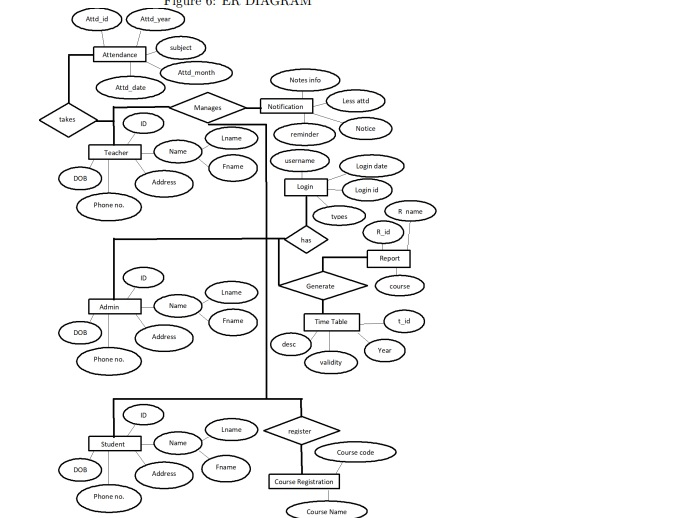
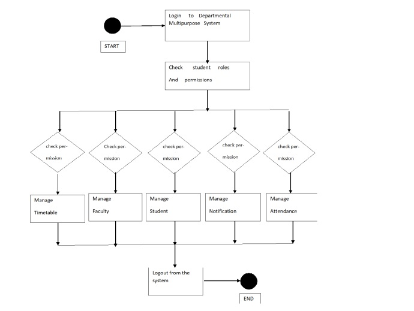
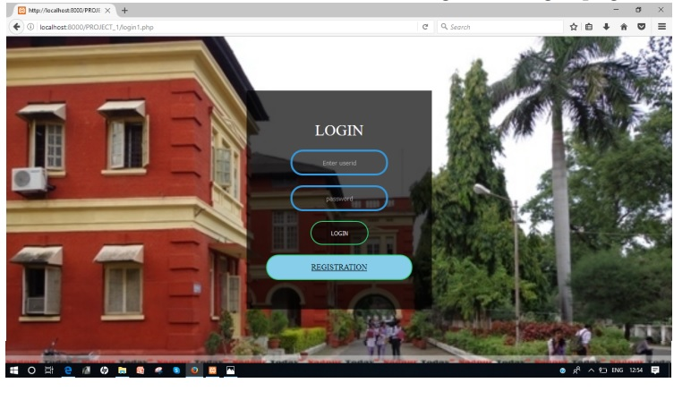
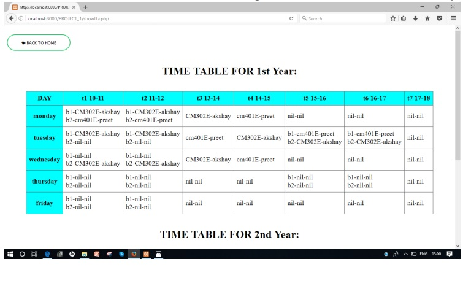
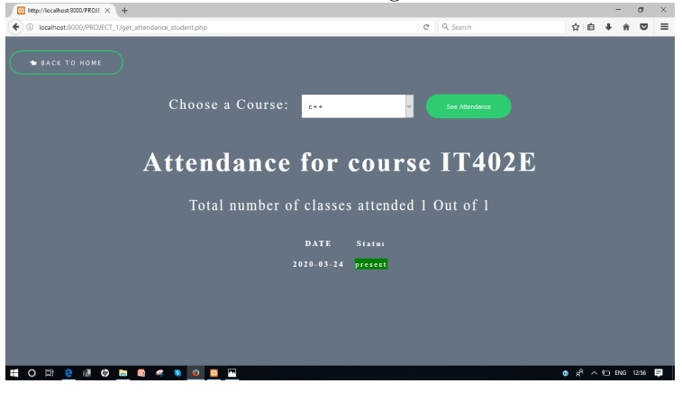
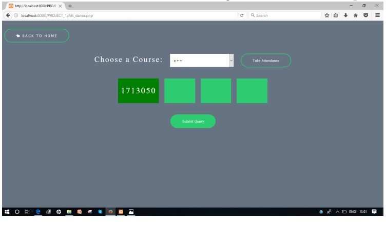

# DMS

**A Webapp for college** where stuents and teacher can manage various college related activities like **timetable,announcemnets,notifications,notes,assignments,courses,courses related various important content,etc.**  

# Environment Setup

Download XAMPP/WAMP/MAMP latest version  

Copy the folder inside **htdocs folder**  

import the **dms.sql** in MySQL and just import the database with **all constraints enable**  

**SETUP IS READY**  

Navigate to the **URL of APACHE** usually like **http://localhost:8080/DMS/index.php**  

# System Design Diagrams  

 **ER DIAGRAM**
  

 **Activity Diagram**
 
 
 
 # Screenshots
 **Login PAGE**  
 
   
 
 **TimeTable**  
 
 
 
 **Student Side Attendance Page**  
 
 
 
 **Teacher Side Attendance Page**
 
 
 
 
 
